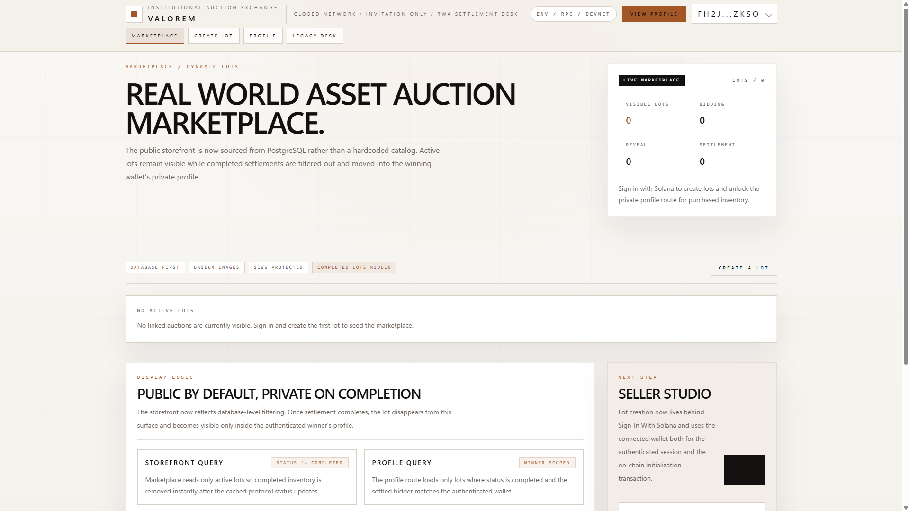

# Valorem Monorepo



Valorem is organized around three primary work areas:

- `frontend/` for application development
- `packages/valorem-sdk/` for the shared TypeScript SDK
- `contracts/` for the Anchor/Rust protocol workspace

The repository root is intentionally kept as the orchestration layer. It coordinates the workspace, CI, Docker/devcontainer setup, and shared entry-point scripts without becoming the default place for feature work.

## Repository Layout

```text
.
|-- contracts/
|-- docs/
|-- frontend/
|-- packages/
|-- .devcontainer/
|-- .github/
|-- docker-compose.yml
`-- package.json
```

## Working By Area

From the repository root:

```bash
npm install
npm run dev
npm run build
npm run test
npm run protocol:unit
```

From `frontend/`:

```bash
npm run dev
npm run build
npm run test
npm run typecheck
```

From `packages/valorem-sdk/`:

```bash
npm run build
npm run test
npm run typecheck
```

From `contracts/`:

```bash
npm run build
npm run unit
npm run test
```

## Dependency Management

The committed npm lockfile lives at the repository root. Subdirectory `package-lock.json` files are ignored on purpose so dependency management stays centralized while still letting people work from the area they care about.

The protocol workspace remains connected to the SDK and frontend through generated IDL types at `packages/valorem-sdk/src/idl/generated`.

## Documentation

Long-form architecture, planning, implementation, and validation material lives under `docs/`. Start with `docs/README.md` for the index.
